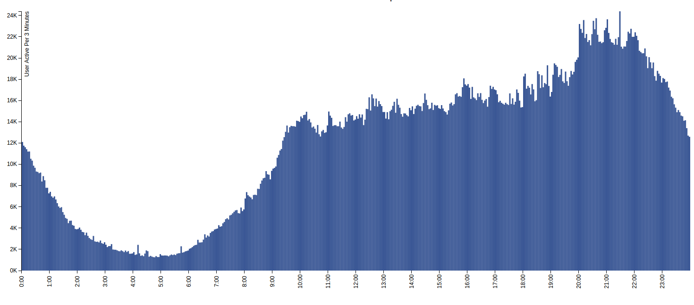

# Facebook Active Time Analysis

My personal side project. 
I try to start something with NodeJS. While thinking, this project come in to my mind.

How do I know when is the most active time of Thailand people in Facebook.
I started with fetching data from public comment in popular page in Facebook.

Then map the timestamp of data to the graph. 
Here what's graph look like : [http://neungkl.com/portfolio/live/fbactiveanalysis.html](http://neungkl.com/portfolio/live/fbactiveanalysis.html)

Sample data records :
66 Pages - 35,450 Posts - 5,789,525 Comments

## Process

1. I start with randomize popular Facebook page selected by me.
2. I create a website that can handle to page list that easily to add and remove.
3. Fetching the comment and timestamp from several page from the list from (3).
4. Run program about 2-3 days long.
5. Extract timestamp from collected data and plot to the graph.
6. Done.

## Usage

`npm install && node app.js`

--------------

โปรแกรมวิเคราะห์เวลาการใช้ Facebook ของคนไทย โดยการเก็บประวัติการคอมเม้นท์ในเพจดังๆต่างๆ
โดยใช้ Node.js + MongoDB ในการ handle ข้อมูลและการทำงานต่างๆ
นอกจากนี้ยังใช้ Facebook API ในการดึงข้อมูลจากเพจต่างๆแล้วทำวิเคราะห์สรุปออกมาในรูปแบบของกราฟ

Sample Data ทั้งหมด :
66 เพจ – 35,450 โพส – 5,789,525 คอมเม้นท์

อ่านรายละเอียดเพิ่มเติมได้ที่
[http://blog.neungkl.com/2015/05/18/facebook-activetime-analysis/](http://blog.neungkl.com/2015/05/18/facebook-activetime-analysis/)
